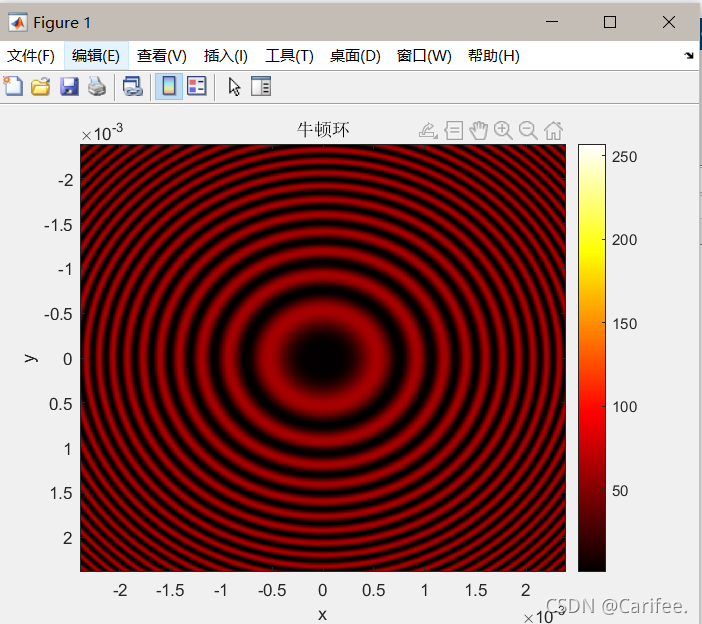

# 物演智启 / PhysicsLab Pro

一个面向物理实验教学的桌面端仿真与分析平台。项目基于 `PyQt6` 构建，围绕“仿真演示、图样分析、数据处理、智能答疑”四个方向，提供光学、热学、振动学等实验教学场景的可视化支持，适合课堂演示、实验预习、微课录制和课后探究。



## 项目简介

本项目将多个常见物理实验教学需求整合到同一套桌面应用中，核心目标是把抽象规律转化为可观察、可操作、可分析的界面流程，帮助教师和学生更直观地理解实验现象与物理模型之间的关系。

当前主界面包含 5 个核心模块，并在右侧提供 AI 虚拟助教停靠面板：

- 光学虚拟仿真实验
- 光学图样分析
- 热力学模拟仿真实验
- 振动学实验室
- 数据工作台
- AI 虚拟助教

## 功能亮点

### 1. 光学虚拟仿真

- 支持牛顿环、劈尖干涉、双缝干涉三类实验
- 可调节波长、曲率半径、空气隙、缝宽、缝距等参数
- 同时展示干涉图样与物理结构示意，便于“现象 - 模型”对照教学

### 2. 光学图样分析

- 支持加载图片并手动选点，提取亮度分布曲线
- 支持视频逐帧亮度分析、平滑处理与峰值统计
- 支持干涉条纹数量、平均间距等结果输出

### 3. 热力学模拟仿真实验

- 通过分子动画、活塞模型和状态量联动展示理想气体过程
- 支持等温、等体、等压三类过程
- 联动绘制 `P-V`、`P-T`、`V-T` 图像

### 4. 振动学实验室

- 支持单个简谐振动、同方向合成、拍振、正交合成等场景
- 提供弹簧振子、相量图、轨迹图、包络线等多种视图
- 支持微课录制导出 GIF，便于教学演示素材生产

### 5. 数据工作台

- 支持单列数据和双列数据录入
- 支持散点图、折线图、柱状图、箱型图、直方图展示
- 支持基础统计、自动拟合与不确定度计算

### 6. AI 虚拟助教

- 支持配置兼容 OpenAI Chat Completions 的接口
- 默认面向 DeepSeek 风格接口进行配置
- 可结合实验现象、曲线数据和问题描述进行答疑

## 技术栈

- GUI: `PyQt6`
- 图像处理: `OpenCV`、`NumPy`
- 科学计算: `SciPy`
- 数据分析: `Pandas`
- 绘图: `Matplotlib`
- OpenGL 仿真: `PyOpenGL`
- 图像导出: `Pillow`
- AI 接口调用: `openai` Python SDK

## 安装与运行

### 1. 安装依赖

```powershell
python -m venv .venv
.venv\Scripts\activate
pip install -r requirements.txt
```

### 2. 启动项目

```powershell
python main.py
```

也可以使用包方式启动：

```powershell
python -m physicslab
```

## AI 配置说明

项目支持在界面中直接配置 AI 接口，也支持通过环境变量提供默认值：

- `DEEPSEEK_API_KEY`
- `DEEPSEEK_BASE_URL`
- `DEEPSEEK_MODEL`

配置会保存到本地设置文件，默认路径类似于：

```text
%LOCALAPPDATA%\PhysicsLabPro\settings.json
```

## 项目结构

```text
09_physicslab-pro/
├─ algorithms.py
├─ main.py
├─ README.md
├─ requirements.txt
├─ 牛顿环.png
└─ physicslab/
   ├─ __init__.py
   ├─ __main__.py
   ├─ ai_assistant.py
   ├─ app.py
   ├─ config.py
   ├─ data_workstation.py
   ├─ optics_tab.py
   ├─ simulation.py
   ├─ thermodynamics_tab.py
   ├─ vibration_tab.py
   ├─ widgets.py
   └─ workers.py
```

## 各代码文件说明

### 根目录

| 文件 | 说明 |
| --- | --- |
| `main.py` | 项目启动入口，调用 `physicslab.app.main()` 启动桌面应用。 |
| `algorithms.py` | 核心算法模块，封装图像亮度提取、峰值检测、干涉图样分析、信号平滑、曲线拟合、不确定度计算和统计分析等通用算法。 |
| `requirements.txt` | 项目依赖列表，包含 GUI、数值计算、图像处理、绘图、OpenGL 和 AI SDK 等运行所需包。 |
| `牛顿环.png` | 项目展示素材，可作为 README 或演示文档中的效果图。 |

### `physicslab/` 包内文件

| 文件 | 说明 |
| --- | --- |
| `physicslab/__init__.py` | 包导出文件，对外暴露 `MainWindow` 和 `main`。 |
| `physicslab/__main__.py` | 包级启动入口，使 `python -m physicslab` 可直接运行。 |
| `physicslab/app.py` | 主窗口实现文件，负责创建应用主界面、5 个标签页、菜单栏和 AI 停靠窗口，是整个应用的 UI 总入口。 |
| `physicslab/config.py` | 配置读写模块，负责默认设置合并、本地 `settings.json` 的加载与保存，以及 AI 配置项管理。 |
| `physicslab/ai_assistant.py` | AI 助手界面模块，包含 AI 设置对话框和右侧聊天面板，用于提问、展示回复和管理接口配置。 |
| `physicslab/workers.py` | 后台线程模块，包含 `LLMWorker` 和 `VideoWorker`，分别负责 AI 请求和视频帧分析，避免阻塞主线程。 |
| `physicslab/widgets.py` | 通用组件库，包含滑块数值联动控件、可点击图像标签和 Matplotlib 画布等多个可复用 UI 组件。 |
| `physicslab/simulation.py` | 光学仿真底层模块，包含 OpenGL/绘制版干涉图样渲染组件、实验模型示意组件，以及较完整的虚拟实验界面实现。 |
| `physicslab/optics_tab.py` | 光学实验标签页实现，整合图片分析、视频分析和虚拟仿真三类光学实验流程，并提供结果展示与数据导出。 |
| `physicslab/data_workstation.py` | 数据工作台模块，负责表格录入、图表绘制、统计结果展示、自动拟合和不确定度计算等数据处理功能。 |
| `physicslab/thermodynamics_tab.py` | 热力学实验标签页，包含理想气体腔体动画、过程控制参数区和 `P-V-T` 联动绘图逻辑。 |
| `physicslab/vibration_tab.py` | 振动学实验室模块，是项目中最复杂的教学场景文件，负责简谐振动、拍振、相量图、轨迹分析和 GIF 录制导出等功能。 |

## 核心模块关系

- `app.py` 负责把各实验页拼装成一个统一桌面应用
- `optics_tab.py`、`thermodynamics_tab.py`、`vibration_tab.py`、`data_workstation.py` 分别对应具体教学模块
- `widgets.py` 和 `workers.py` 为上层实验页提供通用控件与后台任务支持
- `algorithms.py` 为图像分析、信号处理、统计和拟合提供算法基础
- `config.py` 与 `ai_assistant.py` 一起完成 AI 接口配置与交互闭环

## 适用场景

- 课堂演示与实验现象讲解
- 虚拟仿真实验辅助教学
- 微课录制与教学素材生产
- 课后自主探究与数据分析训练
- 面向比赛或课程项目的教学辅助作品展示

## 后续可扩展方向

- 增加更多实验主题，如电学、力学、近代物理实验
- 支持实验数据保存、工程文件管理和结果回放
- 增加教学案例模板、实验任务单和导出报告功能
- 补充单元测试与模块化文档，提升项目可维护性
